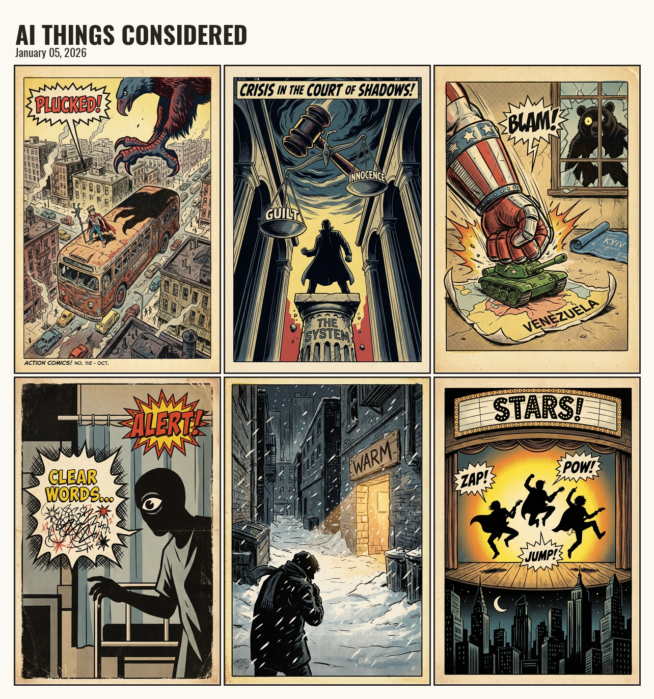

# AI Things Considered

A daily comic strip generator inspired by NPR's All Things Considered.

Every day, this system reads the latest stories from NPR's All Things Considered RSS feed, selects six with visual potential, and renders them as a vintage newspaper-style comic strip using Gemini AI.

## Example Output



## Architecture

```
┌─────────────────────────────────────────────────────────────┐
│  AI Things Considered Pipeline                              │
│                                                             │
│  1. FETCH    → RSS feed (feeds.npr.org/2/rss.xml)          │
│  2. SELECT   → Gemini 2.5 Flash picks 6 stories            │
│  3. PROMPT   → Gemini 2.5 Flash creates image prompts      │
│  4. RENDER   → Gemini 3 Pro generates panel images         │
│  5. COMPOSE  → PIL assembles 3x2 grid with Oswald font     │
│  6. OUTPUT   → {date}.png + {date}.json + latest files     │
└─────────────────────────────────────────────────────────────┘
```

## Setup

1. Clone this repo
2. Copy `.env.example` to `.env` and add your Google AI API key:
   ```
   GOOGLE_AI_API_KEY=your_key_here
   ```
   Get a key from [aistudio.google.com/app/apikey](https://aistudio.google.com/app/apikey)

3. Install dependencies:
   ```bash
   pip install google-genai python-dotenv feedparser Pillow
   ```

## Usage

```bash
python execution/ai_things_considered.py
```

To regenerate a specific date:
```bash
python execution/ai_things_considered.py 2026-01-16
```

Output goes to `./output/` by default. Set `OUTPUT_DIR` in `.env` to change this.

## Reliability

Image generation includes automatic retry logic:
- 3 attempts per panel with exponential backoff
- Minimum 4/6 panels required or the run aborts
- Detailed error logging for failed attempts

## Output Files

Each run produces:

```
output/
├── {YYYY-MM-DD}.png      # Dated comic strip
├── {YYYY-MM-DD}.json     # Dated metadata
├── latest.json           # Copy of current day's metadata
├── latest-1.png          # Most recent comic
└── latest-2.png          # Second most recent comic
```

The `latest-*` files make it easy to embed the comic on a website without knowing the date.

### Metadata Format

```json
{
  "date": "2026-01-05",
  "image": "2026-01-05.png",
  "stories": [
    {
      "panel": 1,
      "title": "Story Title",
      "summary": "Brief description from RSS...",
      "source_url": "https://npr.org/..."
    }
  ]
}
```

## Story Selection

NPR publishes ~20 stories daily. The LLM selects 6 based on:

1. **Visual potential** - Can this translate to a compelling image? Concrete events rank higher than abstract policy debates.
2. **Topic diversity** - Mix of politics, culture, science, international, human interest.
3. **Significance** - Breaking news takes priority over evergreen features.
4. **Tonal variety** - Balance serious stories with lighter ones.

## Visual Style

The comic uses a vintage newspaper aesthetic:

- Muted earth tone palette (cream, warm brown, dusty blue, sage green)
- Flat geometric shapes with clean linework
- Diagrammatic mid-century illustration style
- Symbolic imagery over literal portraits
- Oswald font for titles

The style is defined in `STYLE_PREFIX` in the main script and can be customized.

## Comic Layout

```
┌──────────────────────────────────────┐
│      AI THINGS CONSIDERED            │
│         January 5, 2026              │
├────────────┬────────────┬────────────┤
│            │            │            │
│  Panel 1   │  Panel 2   │  Panel 3   │
│            │            │            │
├────────────┼────────────┼────────────┤
│            │            │            │
│  Panel 4   │  Panel 5   │  Panel 6   │
│            │            │            │
└────────────┴────────────┴────────────┘
```

- **Grid**: 3 columns × 2 rows
- **Panel aspect ratio**: 2:3 (portrait)
- **Panel borders**: Dark brown outlines
- **Background**: Cream/off-white

## Models Used

- **Story selection**: `gemini-2.5-flash`
- **Prompt generation**: `gemini-2.5-flash`
- **Image generation**: `gemini-3-pro-image-preview` (2:3 aspect, 1K resolution)

## Project Structure

```
AI-Things-Considered/
├── execution/
│   ├── ai_things_considered.py   # Main pipeline script
│   ├── test_gemini_image.py      # API test script
│   └── fonts/                    # Oswald font files
├── prompts/
│   └── story_to_image_prompt.md  # LLM system prompt for image generation
├── output/                       # Generated comics (created on first run)
├── .env.example
├── .env                          # Your API key (not committed)
└── README.md
```

## Customization

### Different News Source

Modify `RSS_FEED` in the main script to use a different RSS feed. You'll also want to update the prompts to match the new source's style.

### Different Visual Style

Edit `STYLE_PREFIX` in the main script to change the aesthetic. The current style is optimized for news illustration but could be adapted for other looks.

### Panel Count

Change `NUM_PANELS` and adjust the composition logic in `compose_comic_strip()` for different grid layouts.

## License

MIT

## Credits

- News content from [NPR's All Things Considered](https://www.npr.org/programs/all-things-considered/)
- Image generation by [Google Gemini](https://deepmind.google/technologies/gemini/)
- [Oswald font](https://fonts.google.com/specimen/Oswald) by Vernon Adams
